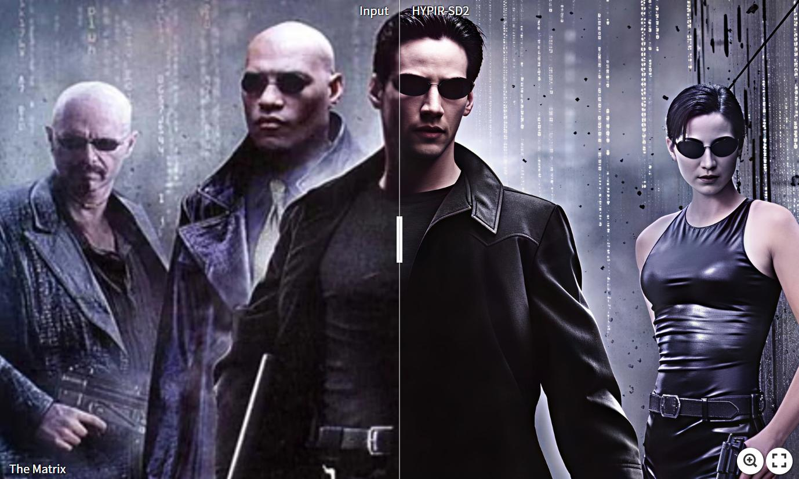
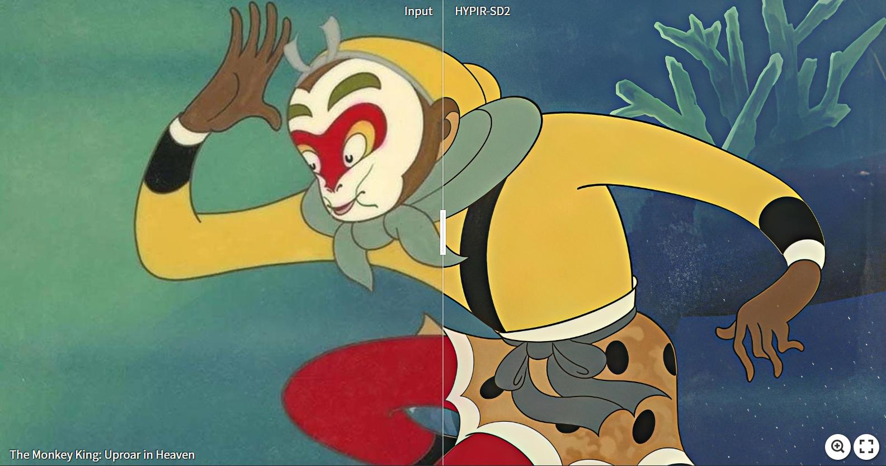

<p align="center">
    
</p>

## HYPIR: Harnessing Diffusion-Yielded Score Priors for Image Restoration

[Paper](https://arxiv.org/abs/2507.20590) | [Project Page](https://hypir.xpixel.group/) | [Project Page (CN)](https://hypirzh.xpixel.group/)

 [](https://replicate.com/0x3f3f3f3fun/hypir-sd2) [](https://openxlab.org.cn/apps/detail/linxinqi/HYPIR-SD2) [](https://colab.research.google.com/drive/1MbpICKc22S6ysD32uj3ORkqg6AgZrNpx?usp=sharing)

[Xinqi Lin](https://0x3f3f3f3fun.github.io/)<sup>1,2</sup>, [Fanghua Yu](https://github.com/Fanghua-Yu)<sup>1</sup>, Jinfan Hu<sup>1,2</sup>, [Zhiyuan You](https://zhiyuanyou.github.io/)<sup>1,3</sup>, Wu Shi<sup>1</sup>, [Jimmy S. Ren](https://www.jimmyren.com/)<sup>4,5</sup>, [Jinjin Gu](https://www.jasongt.com/)<sup>6,\*</sup>, [Chao Dong](https://scholar.google.com.hk/citations?user=OSDCB0UAAAAJ)<sup>1,7,\*</sup>

\*: Corresponding author

<sup>1</sup>Shenzhen Institutes of Advanced Technology, Chinese Academy of Sciences<br><sup>2</sup>University of Chinese Academy of Sciences<br><sup>3</sup>The Chinese University of Hong Kong<br><sup>4</sup>SenseTime Research<br><sup>5</sup>Hong Kong Metropolitan University<br><sup>6</sup>INSAIT, Sofia University<br><sup>7</sup>Shenzhen University of Advanced Technology

<p align="center">
    
</p>

:star:If HYPIR is helpful for you, please help star this repo. Thanks!:hugs:

## :book:Contents

- [What's Next](#next)
- [Gallery](#gallery)
- [Update](#update)
- [Installation](#installation)
- [Pretrained Models](#pretrained_models)
- [Quick Start](#quick_start)
- [Inference](#inference)
- [Train](#train)

## <a name="next"></a>:soon:What's Next

**Our current open-source version** is based on the Stable Diffusion 2.1. While the number of parameters is small, this model was trained on our best-quality data and with significant computational resources (batch size 1024). Therefore, its performance is also quite good. Some examples [here](#gallery).

**Our most advanced model** has been launched on [suppixel.ai](https://supir.suppixel.ai/home) and [suppixel.cn](https://www.suppixel.cn/home)!🔥🔥🔥 We welcome you to experience it. This state-of-the-art model offers **more stable results**, **more flexible capabilities**, while still maintaining **incredibly fast speeds**.

⚠️⚠️⚠️The following website is not under our operation. They do not have a license for our model and have used several of our comparison images without our permission. Please verify the legitimacy of any site to prevent financial loss.
- https://www.hypir.org/

## <a name="gallery"></a>:eyes:Gallery

The following cases were upscaled by HYPIR-SD2. All resolutions are above 2k.

<table >
  <tbody>
    <tr>
      <td><a href="https://imgsli.com/NDAzMjA5"></a></td>
      <td><a href="https://imgsli.com/NDAzMjEx"></a></td>
    </tr>
    <tr>
      <td><a href="https://imgsli.com/NDAzMjE0"></a><br><a href="https://imgsli.com/NDAzMjI1"></a></td>
      <td><a href="https://imgsli.com/NDAzMjE4"></a></td>
    </tr>
    <tr>
      <td><a href="https://imgsli.com/NDAzMjIz"></a></td>
      <td><a href="https://imgsli.com/NDAzMjI3"></a></td>
    </tr>
    <tr>
      <td><a href="https://imgsli.com/NDAzMjI0"></a></td>
      <td><a href="https://imgsli.com/NDAzMjI5"></a></td>
    </tr>
  </tbody>
</table>

## <a name="update"></a>:new:Update

- **2025.07.28**: :white_check_mark: Provide [colab](https://colab.research.google.com/drive/1MbpICKc22S6ysD32uj3ORkqg6AgZrNpx?usp=sharing) example. Free T4 GPU is good enough for running this model!
- **2025.07.28**: :white_check_mark: Integrated to [openxlab](https://openxlab.org.cn/apps/detail/linxinqi/HYPIR-SD2).
- **2025.07.19**: :white_check_mark: Integrated to [replicate](https://replicate.com/0x3f3f3f3fun/hypir-sd2).
- **2025.07.19**: This repo is created.

## <a name="installation"></a>:gear:Installation

```shell
git clone https://github.com/XPixelGroup/HYPIR.git
cd HYPIR
conda create -n hypir python=3.10
conda activate hypir
pip install -r requirements.txt
```

## <a name="pretrained_models"></a>:dna:Pretrained Models

| Model Name | Description | HuggingFace | OpenXLab |
| :---------: | :----------: | :----------: | :----------: |
| HYPIR_sd2.pth | Lora weights of HYPIR-SD2 | [download](https://huggingface.co/lxq007/HYPIR/tree/main) | [download](https://openxlab.org.cn/models/detail/linxinqi/HYPIR/tree/main) |

## <a name="quick_start"></a>:flight_departure:Quick Start

1. Download model weight `HYPIR_sd2.pth`.

2. Fill `weight_path` in [configs/sd2_gradio.yaml](configs/sd2_gradio.yaml).

3. Run the following command to launch gradio.

    ```shell
    python app.py --config configs/sd2_gradio.yaml --local --device cuda
    ```
4. (Optional) Tired of manually typing out prompts for your images? Let GPT do the work for you!

    First, create a file named `.env` in the project directory.

    ```conf
    GPT_API_KEY=your-awesome-api-key
    GPT_BASE_URL=openai-gpt-base-url
    GPT_MODEL=gpt-4o-mini
    ```

    Second, add your API base URL and API key in the `.env` file. For the model, 4o-mini is usually sufficient.

    Finally, pass `--gpt_caption` argument to the program, and type "auto" in the prompt box to use GPT-generated prompt.

<div align="center">
    <kbd></img></kbd>
</div>

## <a name="inference"></a>:crossed_swords:Inference

More details can be found by running `python test.py --help`.

```shell
LORA_MODULES_LIST=(to_k to_q to_v to_out.0 conv conv1 conv2 conv_shortcut conv_out proj_in proj_out ff.net.2 ff.net.0.proj)
IFS=','
LORA_MODULES="${LORA_MODULES_LIST[*]}"
unset IFS

python test.py \
--base_model_type sd2 \
--base_model_path stabilityai/stable-diffusion-2-1-base \
--model_t 200 \
--coeff_t 200 \
--lora_rank 256 \
--lora_modules $LORA_MODULES \
--weight_path path/to/HYPIR_sd2.pth \
--patch_size 512 \
--stride 256 \
--lq_dir examples/lq \
--scale_by factor \
--upscale 4 \
--txt_dir examples/prompt \
--output_dir results/examples \
--seed 231 \
--device cuda
```

## <a name="train"></a>:stars:Train

1. Generate a parquet file to save both image paths and prompts. For example:

    ```python
    import os
    import polars as pl
    # Recursively collect image files. For example, you can crop 
    # the LSDIR dataset into 512x512 patches and place all patches 
    # in one folder.
    image_dir = "/opt/data/common/data260t/LSDIR_512"
    image_exts = (".jpg", ".jpeg", ".png")
    image_paths = []
    for root, dirs, files in os.walk(image_dir):
        for file in files:
            if file.lower().endswith(image_exts):
                image_paths.append(os.path.join(root, file))
    # Create dataframe object with prompts. Here we use empty 
    # prompt for simplicity.
    df = pl.from_dict({
        "image_path": image_paths,
        "prompt": [""] * len(image_paths)
    })
    # Save as parquet file, which will be used in the next step.
    df.write_parquet("path/to/save/LSDIR_512_nulltxt.parquet")
    ```

2. Fill in the values marked as TODO in [configs/sd2_train.yaml](configs/sd2_train.yaml). For example:

    ```yaml
    output_dir: /path/to/save/experiment
    data_config:
      train:
        ...
        dataset:
          target: HYPIR.dataset.realesrgan.RealESRGANDataset
          params:
            file_meta:
              file_list: path/to/LSDIR_512_nulltxt.parquet
              image_path_prefix: ""
              image_path_key: image_path
              prompt_key: prompt
            ...
    ```

3. Start training.

    ```shell
    accelerate launch train.py --config configs/sd2_train.yaml
    ```

## :email: Contact

For questions about code or paper, please email `xqlin0613@gmail.com`.

For authorization and collaboration inquiries, please email `jinjin.gu@suppixel.ai`.

## Non-Commercial Use Only Declaration
The HYPIR ("Software") is made available for use, reproduction, and distribution strictly for non-commercial purposes. For the purposes of this declaration, "non-commercial" is defined as not primarily intended for or directed towards commercial advantage or monetary compensation.

By using, reproducing, or distributing the Software, you agree to abide by this restriction and not to use the Software for any commercial purposes without obtaining prior written permission from Dr. Jinjin Gu.

This declaration does not in any way limit the rights under any open source license that may apply to the Software; it solely adds a condition that the Software shall not be used for commercial purposes.

IN NO EVENT SHALL THE AUTHORS OR COPYRIGHT HOLDERS BE LIABLE FOR ANY CLAIM, DAMAGES OR OTHER LIABILITY, WHETHER IN AN ACTION OF CONTRACT, TORT OR OTHERWISE, ARISING FROM, OUT OF OR IN CONNECTION WITH THE SOFTWARE OR THE USE OR OTHER DEALINGS IN THE SOFTWARE.

For inquiries or to obtain permission for commercial use, please contact Dr. Jinjin Gu (jinjin.gu@suppixel.ai).
