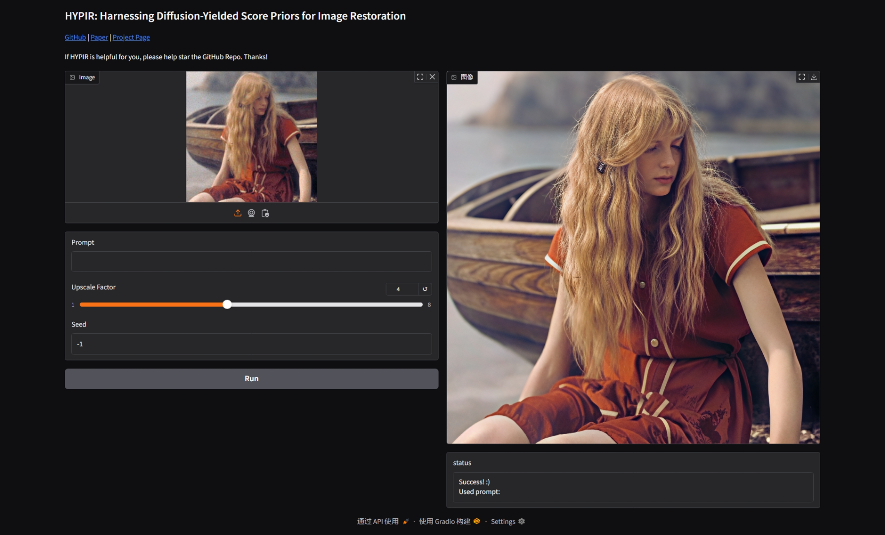

<p align="center">
    
</p>

## HYPIR: Harnessing Diffusion-Yielded Score Priors for Image Restoration

[Paper](TODO) | [Project Page](TODO)

 [](https://replicate.com/0x3f3f3f3fun/hypir-sd2) [](https://openxlab.org.cn/apps/detail/linxinqi/HYPIR-SD2) [](https://colab.research.google.com/drive/1MbpICKc22S6ysD32uj3ORkqg6AgZrNpx?usp=sharing)

Xinqi Lin<sup>1,2</sup>, [Fanghua Yu](https://github.com/Fanghua-Yu)<sup>1</sup>, Jinfan Hu<sup>1,2</sup>, [Zhiyuan You](https://zhiyuanyou.github.io/)<sup>1,3</sup>, Wu Shi<sup>1</sup>, [Jimmy S. Ren](https://www.jimmyren.com/)<sup>4,5</sup>, [Jinjin Gu](https://www.jasongt.com/)<sup>6,\*</sup>, [Chao Dong](https://scholar.google.com.hk/citations?user=OSDCB0UAAAAJ)<sup>1,\*</sup>

\*: Corresponding author

<sup>1</sup>Shenzhen Institutes of Advanced Technology, Chinese Academy of Sciences<br><sup>2</sup>University of Chinese Academy of Sciences<br><sup>3</sup>The Chinese University of Hong Kong<br><sup>4</sup>SenseTime Research<br><sup>5</sup>Hong Kong Metropolitan University<br><sup>6</sup>INSAIT, Sofia University

<p align="center">
    
</p>

:star:If HypIR is helpful for you, please help star this repo. Thanks!:hugs:

## :book:Table Of Contents

- [What's Next](#next)
- [Update](#update)
- [Installation](#installation)
- [Pretrained Models](#pretrained_models)
- [Quick Start](#quick_start)
- [Train](#train)

## <a name="next"></a>:soon:What's Next

Our current open-source version is based on the Stable Diffusion 2.1 small model.

We'll provide access to more advanced models based on **FLUX** and **Stable Diffusion 3.5** through web interfaces and APIs in the future. Stay tuned!:sparkles:

## <a name="update"></a>:new:Update

- **2025.07.19**: :white_check_mark: Integrated to [replicate](https://replicate.com/0x3f3f3f3fun/hypir-sd2).
- **2025.07.19**: This repo is created.

## <a name="installation"></a>:gear:Installation

```shell
git clone https://github.com/XPixelGroup/HYPIR.git
cd HYPIR
conda create -n hypir python=3.10
conda activate hypir
pip install -r requirements.txt
```

## <a name="pretrained_models"></a>:dna:Pretrained Models

| Model Name | Description | HuggingFace | OpenXLab |
| :---------: | :----------: | :----------: | :----------: |
| HYPIR_sd2.pth | Lora weights of HYPIR-SD2 | [download](https://huggingface.co/lxq007/HYPIR/tree/main) | [download](https://openxlab.org.cn/models/detail/linxinqi/HYPIR/tree/main) |

## <a name="quick_start"></a>:flight_departure:Quick Start

1. Download model weight `HYPIR_sd2.pth`.

2. Fill `weight_path` in [configs/sd2_gradio.yaml](configs/sd2_gradio.yaml).

3. Run the following command to launch gradio.

    ```shell
    python app.py --config configs/sd2_gradio.yaml --local --device cuda
    ```
4. (Optional) Tired of manually typing out prompts for your images? Let GPT do the work for you!

    First, create a file named `.env` in the project directory.

    ```conf
    GPT_API_KEY=your-awesome-api-key
    GPT_BASE_URL=openai-gpt-base-url
    GPT_MODEL=gpt-4o-mini
    ```

    Second, add your API base URL and API key in the `.env` file. For the model, 4o-mini is usually sufficient.

    Finally, pass `--gpt_caption` argument to the program, and type "auto" in the prompt box to use GPT-generated prompt.

<div align="center">
    <kbd></img></kbd>
</div>

## <a name="train"></a>:stars:Train

1. Generate a parquet file to save both image paths and prompts. For example:

    ```python
    import os
    import polars as pl
    # Recursively collect image files. For example, you can crop 
    # the LSDIR dataset into 512x512 patches and place all patches 
    # in one folder.
    image_dir = "/opt/data/common/data260t/LSDIR_512"
    image_exts = (".jpg", ".jpeg", ".png")
    image_paths = []
    for root, dirs, files in os.walk(image_dir):
        for file in files:
            if file.lower().endswith(image_exts):
                image_paths.append(os.path.join(root, file))
    # Create dataframe object with prompts. Here we use empty 
    # prompt for simplicity.
    df = pl.from_dict({
        "image_path": image_paths,
        "prompt": [""] * len(image_paths)
    })
    # Save as parquet file, which will be used in the next step.
    df.write_parquet("path/to/save/LSDIR_512_nulltxt.parquet")
    ```

2. Fill in the values marked as TODO in [configs/sd2_train.yaml](configs/sd2_train.yaml). For example:

    ```yaml
    output_dir: /path/to/save/experiment
    data_config:
      train:
        ...
        dataset:
          target: HYPIR.dataset.realesrgan.RealESRGANDataset
          params:
            file_meta:
              file_list: path/to/save/LSDIR_512_nulltxt.parquet
              image_path_prefix: ""
              image_path_key: image_path
              prompt_key: prompt
            ...
    ```

3. Start training.

    ```shell
    accelerate launch train.py --config configs/sd2_train.yaml
    ```

## :email: Contact

For questions about code or paper, please email `xqlin0613@gmail.com`.

For authorization and collaboration inquiries, please email `jinjin.gu@suppixel.ai`.

## Non-Commercial Use Only Declaration
The HYPIR ("Software") is made available for use, reproduction, and distribution strictly for non-commercial purposes. For the purposes of this declaration, "non-commercial" is defined as not primarily intended for or directed towards commercial advantage or monetary compensation.

By using, reproducing, or distributing the Software, you agree to abide by this restriction and not to use the Software for any commercial purposes without obtaining prior written permission from Dr. Jinjin Gu.

This declaration does not in any way limit the rights under any open source license that may apply to the Software; it solely adds a condition that the Software shall not be used for commercial purposes.

IN NO EVENT SHALL THE AUTHORS OR COPYRIGHT HOLDERS BE LIABLE FOR ANY CLAIM, DAMAGES OR OTHER LIABILITY, WHETHER IN AN ACTION OF CONTRACT, TORT OR OTHERWISE, ARISING FROM, OUT OF OR IN CONNECTION WITH THE SOFTWARE OR THE USE OR OTHER DEALINGS IN THE SOFTWARE.

For inquiries or to obtain permission for commercial use, please contact Dr. Jinjin Gu (jinjin.gu@suppixel.ai).